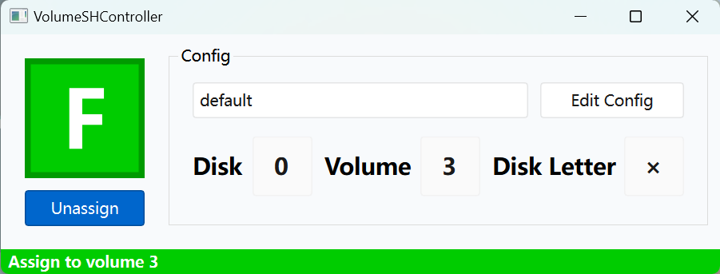

# VolumeAssignController

This is a simple program that allows you to assign or unassign a volume in a simple click. It is based on `diskpart.exe`.

*Since MucheXD is a native Chinese speaker. In case of conflict, please refer to the instructions [in Chinese](README_ZH.md).*

**This project is not part of MucheXD's schedule, so there are many potential issues.**

## Screenshot



## How To Use

### Configurations

There will be a file `config.mtd` in the program's running dir, you can open it in any text editor (json editor recommended). The config file follows json grammar. You should edit it like the example below:

```json

{

    "configs": [

        {

            "name": "default",

            "disk": 0,

            "volume": 0,

            "char": "Z"

        }

    ],

    "default": 0

}

```

`configs` is an array that contains all sub-configs, which you can choose in a combobox later. Every object includes `name`, `disk`, `volume` and `char` four keys, their function listed below:

| key | value | description |

| --- | --- | --- |

| name | string | the sub-config's name, used in UI |

| disk | int | the disk index [How can I find it](#About disk & volume index) |

| volume | int | the volume index[How can I find it](#About disk & volume index) |

| char | string | the target disk letter to be assigned. You can omit this, in that case, the program will choose the smallest character available. |

`default` defines the default sub-config using the sub-config's index.

`disableWarning` is a boolen to disable warning which occur when you try to unassign disk "C" if set to `true` (not recommend).

### Assign & Unassign

Just simply click the button `Assign` or `Unassign`! The current volume state will show on top of the button.

### Choose sub-config

By choose in combox, you can switch sub-config. The current config information will show under it.

## Others

### Statement

Assign & Unassign sometimes cases problems if there is program using it. Be careful youself! Never unassign the system volum! **MucheXD is not responsible for any failures of your computer or the file lost.**

### About disk & volume index

Get the indexs yourself! Here are the introductions:

1. Run `cmd.exe` in administrator mode

  

2. Run commend `diskpart`

  

3. Run commend `list disk` and get the indexs below

  

4. Run commend `select disk [DISK-INDEX]` to select the disk in diskpart

  

5. Run commend `list volume` and get the indexs below

  

### Recommend Environment

- Windows 10 (x64) / Windows 11 (x64)

  

- Microsoft Visual C++ 2015-2022 Redistributable x64

  

### Copyright and License

This program uses the following compilers or support libraries

- Visual Studio 2022

  

- QT 6.5

  

This program is under the LGPL license.

For detailed license content, please refer to its corresponding official website.
